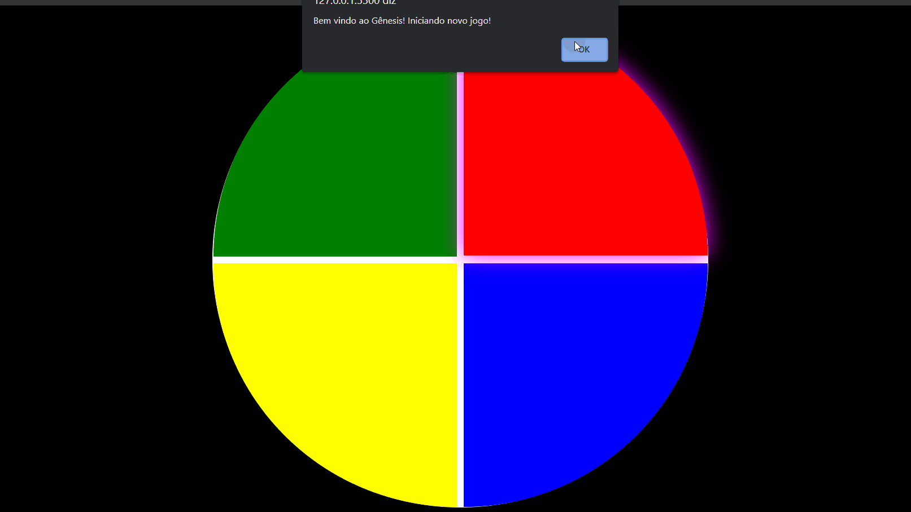

<h1 align="center"> Jogo Gênesis </h1>

<nav>
          <a href="#Technologies">Tecnologias </a>|
          <a href="#Project">Projeto </a>|
          <a href="#licence">Licença </a>
        </nav>

 
 

 
 

<h2 id="Technologies"> Tecnologias </h2>

Esse projeto foi desenvolvido com as seguintes tecnologias:

- HTML
- CSS
- JavaScript

 

<h2 id="Project"> Projeto </h2>

O projeto foi desenvolvido na plataforma <a href="web.digitalinnovation.one/">Digital Innovation One</a> o desafio foi criar o jogo Gênesis utilizando apenas HTML, CSS e Javascript de forma introdutória, sendo o principal conceito, CSS Grid, manipulação de Array e Arrow Functions. Foi colocado em pratica também conhecimentos sobre logica de programação, condicionais e laços de repetição.

<h2 id="license"> Licença </h2>
Esse projeto está sob a licença <a href="https://choosealicense.com/licenses/mit//">MIT</a>. Veja o arquivo LICENSE para mais detalhes.

Feito com ♥ by Leonardo Dantas 👋
